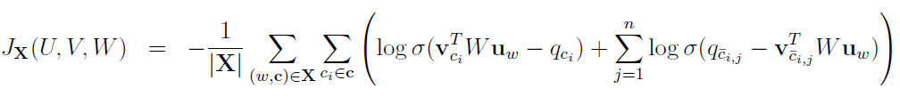
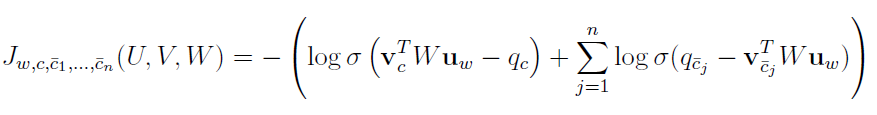

# Information search and retrieval 

## Environment SetUp
In the file tii.yml are the needed packages and libraries for running the projects. Annaconda for Python was used for creating virtual environments.

## General for NMT

Transformer model for neural machine translation (and other small projects) as part of the elective subject "Information search and retrieval.
Application of deep machine learning" (Търсене и извличане на информация. Приложение на дълбоко машинно обучение) from professor Stoqn Mihov at the University of Sofia "Sv. Kliment Ohridski", Bulgaria.

There are two version of the model in the repository. NMT contains olny the trained transformer model, while the BPE_BeamSearch also has BytePair Encoding and Beam Search optimisations. The models translate bulgarian to english. Both projects are written in Python with the PyTorch package for optimised learning algorithms. 

Model perplexity:  14.883834030584168
Corpus BLEU:  37.730389943302676

## Data  
 The two directories contain the 'en_bg_data' which stores the learning data in both bulgarian and english. 180000 pairs of sentences for training in train.en and train.bg, 1000 pairs for development dev.en and dev.bg, and 6000 pairs for testing in test.en and test.bg. 

## Important  
The trained models' files are too big to be uploaded to Github. 

## Console operations: 

1. python run.py prepare – prepares the raw data into the format used to learn (there are differences in the two version). This operation creates the files: CorpusData, wordsData and bpeData for the BPE model. 
2. python run.py train – trains the model based on the hyperparameters in paramaters.py. On every batch in the console is displayed the current cross-entropy. On every test_every number of steps the training stops and the current model translates the developement corpus and returns the current cross-entropy. If the current model is better than the last saved it is updated. After maxExpochs the model is again tested.
3. python run.py extratrain – resumes the training if it has been stopped.
4. python run.py perplexity \<sourceCorpus> \<targetCorpus> – measures the perplexity of a trained model on input sentences sourceCorpus and output targetCorpus
5. python run.py bleu \<targetCorpus> \<resultCorpus> – calculates the BLEU score of a trained model based on it's performence on the target and result corpus. Result Corpus should be the machine translated one and targetCorous should be a proffesionally translated one.
6. python run.py translate \<sourceCorpus> \<resultCorpus>  – translates the sourceCorpus and stores it in the file resultCorpus 
7. python run.py generate \<prefix> – generates a sequence based on the prefix, which should start with a start of sentence token("\<S>") but can otherwise be empty. The results however are rather dissapointing due to the nature of the training 
   
## Byte Pair Encoding and Beam Search Model

 ### BPE  
 
 During the prepare operation a list of 8000 words is created. At first it is populated only by individual letters. As the training corpus is read, the most frequent pair of two letters are stored. This cycle repeats until the 8000 words capacity is hit. This lust includes the special tokens for start and end of words and sentences.

 ### Beam Search

 The Beam Search optimisation has a default beam size 3. It is used to determine the most likely ouput sequence from the top k, where k is the beam size.

 Model perplexity:  10.06999109159907
 Corpus BLEU:  37.75035243850249

## Hyperparameters 

The training was done with the parameters in paramaters.py file and executed on the google collab platfor with T4 GPU.

## Homework 1

A simple autocorrect project that uses the levenstein distance to determine the closest word to the input word. The training corpus has journalist text and the ictionary is extracted from there. The error corpus has pairs of words and their most common spelling mistakes. 

Each mistake has a weight to it, that is calculated based on the number an types of corrections that need to be performed. A list of candidate words is made by taking the inout word and creating every possible pair of two mistakes. Candidates are judjed by a Markov language model to determine the most likely correct word.

## Homework 2

### Word2Vec skip-gram noise contrastive estimation with general multiplicative measure

The project is based on minimising the loss function which is a part of the training of the embedding U (of the correct word) and V(context words).

The parameters:
- U is the embeding of the current word
- V is the embeddings of the context words
- W is a matrix of trainable weights 
- X is the corpus
- w is the index of the current word
- c is an index list of the context words
- c_bar_i_j are the n sampled incorrect words

This is the equation for the loss function in a given point. The activation function is sigma. Minimising this functions' partial derivatives is the training process (lossAndGradient function in grads.py).    

In the same file the function lossAndGradientCumulative has the same purpose but calculates the derivates of a number of words in a batch.     

In lossAndGradientBatched the derivates of the samples are stohastically calculated at the same time to reduce the time needed to train the model and because the samples are independant the result is satisfactory.
